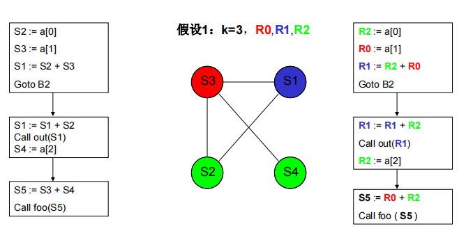
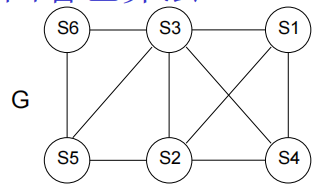
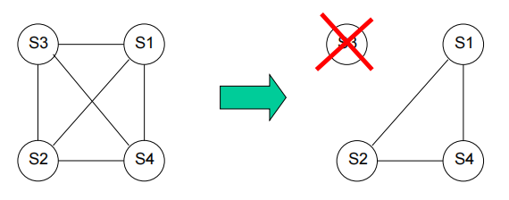
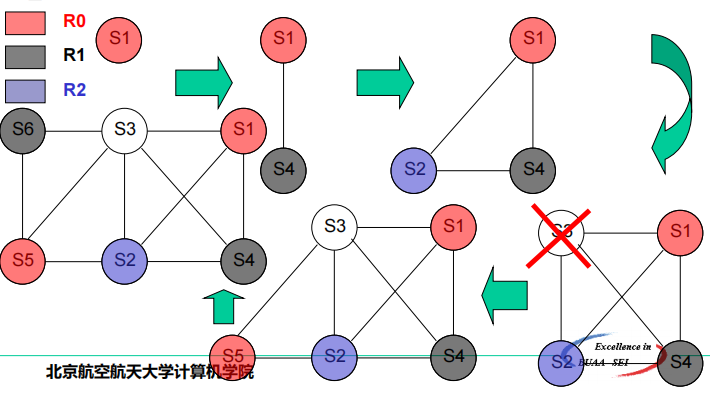

# 第十二章 目标代码生成

[TOC]

## 简介

> 输入
>
> - 源程序的中间表示
>   - 线性表示(波兰式)
>   - 三地址码(四元式)
>   - 栈式中间码(P-CODE)
>   - 图形表示
> - 符号表信息

> 对输入的要求
>
> - 前端已分析、翻译成足够详细的中间表示
> - 中间语言中的标识符表示为目标机器能够直接操作的变量（位、整数、浮点数、指针等）
> - 完成了必要的类型检查，类型转换/检测操作已经加入到中间语言的必要位置
> - 完成语法和必要的语义检查（没有错误）

> 目标程序的种类
>
> - 汇编语言
> - 包含绝对地址的机器语言
> - 可重定位的机器语言

## 12.1 现代微处理体系结构简介

### 12.1.1 指令集架构

- 栈式架构
- 寄存器—寄存器架构

### 12.1.2 存储层次架构

*$\color{Gray}{看了一下，感觉不用看。就计组那些东西}$*

### 12.1.3 流水线

*$\color{Gray}{也不咋用看}$*

## 12.2 地址空间

> - 代码区
>   - 存放目标代码
> - 静态数据区
>   - 全局变量
>   - 静态变量
>   - 常量
> - 动态内存区(内存堆Heap)
>   - 程序员管理（C、C++）
>   - 自动管理（GC）
> - 程序运行栈
>   - 活动记录
>   - 函数调用的上下文现场
>     - 调用方保存的临时寄存器
>     - 被调用方保存的全局寄存器

### 12.2.1 示例分析

*$\color{Gray}{分析不了一点}$*

### 12.2.2 运行栈的设计

> - 子程序/函数运行所需的基本空间
> - 进入时分配，地址空间向下生长
> - 返回时废弃当前运行栈
> - 递归调用是每次调用都获得独立的运行栈空间

典型的**运行栈结构**：

- 函数返回地址
- 全局寄存器保存区
- 临时变量保存区
- 未分配到全局寄存器的局部变量保存区
- 其他辅助信息<a style="color: purple">如PASCAL/PL-I类语言你的DISPLAY区</a>

## 12.4 寄存器分配和指派

> 寄存器的分类：
>
> - 通用寄存器
> - 专用寄存器

> 通用寄存器：
>
> - 保留寄存器
> - 调用方保存的寄存器——==临时寄存器==
> - 被调用方保存的寄存器——==全局寄存器==

### 12.4.1 全局寄存器分配

**分配原则**：

​	**局部变量**参与==全局寄存器==分配，**全局变量**和**静态变量**==不==参与

​	==寄存器专属于线程==

#### 12.4.1.1 引用计数

**原则**：局部变量被引用次数较多，则获得全局寄存器的机会也较大

**注意**：出现在循环、尤其是内层嵌套循环中的变量的被访问次数应得到一定加权。

#### 12.4.1.2 图着色算法 

1. 通过数据流分析，构建变量的冲突图

   变量冲突图

    - 节点为待分配全局寄存器的变量
      
    - 当两个变量中<a style="color: red">一个变量在另一个变量定义/赋值处是活跃的，他们之间便有一条边连接</a>
      
      **变量i在代码n处活跃**，指程序运行时 `i` 在 `n` 处拥有的值在从 `n` 出发的某条路径上会被使用。
      
      直观的，可以认为<a style="color: red">相连的变量无法共用一个全局寄存器或同一存贮单元</a>
      
      <a style="color: red">无连接关系的变量即使占用同一个全局寄存器或同一存贮单元，程序运行也不会出错</a>

2. 若可供分配 k 个全局寄存器，那尝试用 k 种颜色给该冲突图着色

   

   **启发式图着色算法**

   冲突图 `G` 寄存器数目为 `K=3`

   
   
   

$$
\begin{array}{l}
   1. 找到第一个连接边数{\color{Red}{\pmb{小于K}}}的节点，将其从G中移走\\
   2. 重复1，直到无法再从G中移走节点\\
   3. 在途中总选取{\color{Red}{\pmb{适当}}}的节点，将它记录为“不分配全局寄存器”的节点，并从图中移走\\
   4. 重复1-3，直到图中仅剩一个节点
   5. 给剩余的节点选取一种颜色，然后按被移走的倒叙添加节点和边，并依次选取颜色
   \end{array}
$$

 ### 12.4.2 临时寄存器分配

**原则和方法**

- 临时寄存器的**生存范围**

  - 不超越基本快
  - 不跨越函数调用

- 管理方法

  - 寄存器池

    -  G进入基本快，清空临时寄存器池

    - 为当前代码生成目标代码时，任何变量如需使用临时寄存器都可向临时寄存器池申请

    - 临时寄存器池接到申请后

      - K如寄存器池中有空闲寄存器，则标识

        为被改变量申请占用

        并返回该空寄存器

      - 如没有空寄存器，则

        选取一个在即将成成的代码中不会被使用的寄存器写回相应的内存空间

        标识该寄存器被新变量占用

        返回该寄存器

    - 基本块结尾/函数调用发生前

      寄存器池中所有被占用的临时寄存器写回相应的内存空间

      清空临时寄存器池

## 12.5 指令选择

> 不同体系结构采用不同指令集

- RISC

  - ARM，MIPS

- CISC

  - X86

- VLIW/EPIC

  - Itanium
