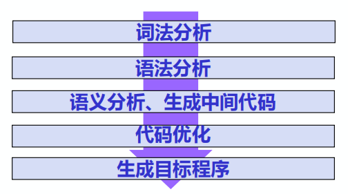
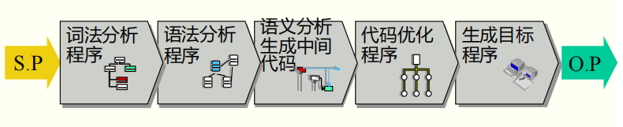
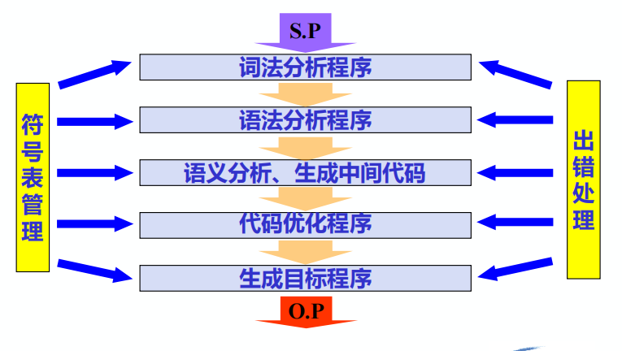
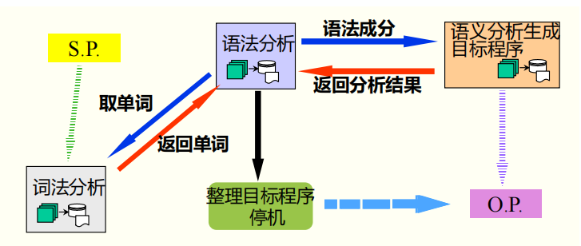
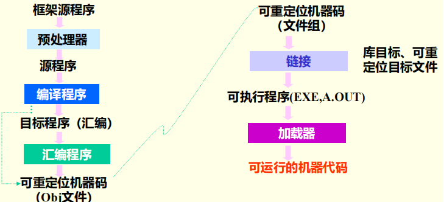

# 第一章 概论

[TOC]

## 1.1 程序设计语言的发展

- 低级语言
  - 字位码、机器语言、汇编语言
  - **特点**：与特定机器有关，效率高、使用和编程复杂、繁琐、费时、易出错
- 高级语言
  - Fortran、Pascal、C、Java等
  - **特点**：不依赖具体硬件结构，可移植性好、对用户要求低、易使用、易维护等

## 1.2 基本概念

- **源程序**

  用汇编语言或高级语言编写的程序称为源程序

- **目标程序**

  用目标语言所表示的程序

  **目标语言**：中间语言、汇编语言或机器语言

- **翻译程序**

  将源程序转换为目标程序的程序

- **汇编程序**

  汇编->机器码的翻译程序

- **编译程序**

  高级语言->目标码的翻译程序

- **解释程序**

  对源程序解释执行的程序

*$\color{Gray}{具体运行过程略}$*

### 1.3 编译程序

### 1.3.1 编译过程

> 将**高级语言程序**翻译为语义等价的**目标程序**的过程

5个阶段

1. **词法分析**

   > 分析和识别单词

   - **单词**：语言的基本单位，一般有4类
     - 保留字或关键字
     - 标识符
     - 常量
     - 分界符和运算符

2. **语法分析**

   > 根据**语法规则**分析、识别出语法成分，并进行语法正确性审查

   *$\color{Gray}{内容略，后面就知道了}$*

3. **语义分析、生成中间代码**

   > 对识别出的各种语法成分进行语义分析，并生成相应的**中间代码**

   - 中间代码：介于源语言和目标语言之间的中间语言形式

   - 生成中间代码的目的

     1. 便于优化
     2. 便于编译程序的移植

   - 中间代码形式

     编译程序设计者可自己设计，常用的有四元式、三元式、逆波兰表示等

4. 代码优化

   > 得到高质量的目标程序

5. 生成目标程序

   > 根据机器由中间代码得到目标程序（地址指令序列），这里也可以优化

### 1.3.2 编译程序的构造

1. 逻辑结构

   按功能将编译过程划分了五个基本阶段。对应的将编译程序划分为五个逻辑阶段

   

   五个阶段中都要做两件事

   1. 建表和查表
   2. 出错处理

   **所以编译程序中都要包括符号表管理和错误处理两个部分**

   - **符号表管理**

     整个编译过程始终贯穿建表和查表

   - **出错处理**

     错误处理功能，能发现错误，也能报告错误的性质和位置

   综上，==典型的编译程序具有7个逻辑部分==

   

2. **遍(PASS)**

   > 对源程序从头到尾扫描一遍，并做有关的加工处理，生成新的源程序中间形式或目标程序，称为一遍

   **遍与基本阶段的区别**

   - 基本阶段

     将源程序翻译为目标程序在逻辑上要完成的工作

   - 遍

     指完成上述五个基本阶段的工作，要经过几次扫描处理

   **一遍扫描**即可完成编译工作的一般称为**一遍扫描编译程序**，其结构为

   

3. 前端后端

   **前端**

   > 将语言程序有关的编译部分称为前端。
   >
   > 包括词法分析、语法分析、语义分析、中间代码生成，即**分析部分**
   >
   > **特点**：与源语言有关

   **后端**

   > 与目标机器有关的部分称为后端。
   >
   > 包括代码优化、目标代码生成，即**综合部分**
   >
   > **特点**：与目标机器有关

4. 编译程序的前后处理器

   > **源程序**：多文件、宏定义和宏调用、包含文件
   >
   > **目标程序**：一般为汇编程序或可重定位的机器码

   

## 1.4 编译技术的应用

- 语法制导的结构化编辑器
- 程序格式化工具
- 软件测试工具
- 程序理解工具
- 高级语言翻译工具
- …
