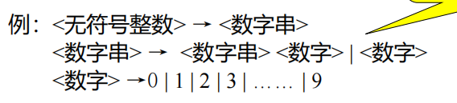
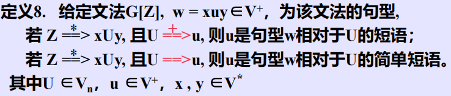
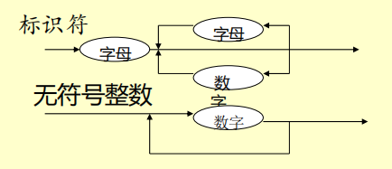
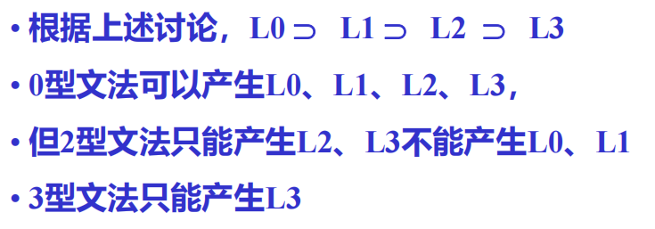

# 第二章 文法和语言的概念和表示

[TOC]

## 2.1 预备知识

1. **字母表和符号串**

   - **字母表**：符号表的非空有限集 $\color{Purple}{Σ=\{a,b,c\}}$
   - **符号**：字母表中的元素 $\color{Purple}{a,b,c}$
   - **符号串**：符号的有穷序列 $\color{Purple}{a,aa,ac,abc}$
   - **空符号串**：无任何符号的符号串 $\color{Purple}{(ε)}$

   形式定义

   > 有字母表 `Σ` ，定义
   >
   > 1.  `ε` 是 `Σ` 上的符号串
   > 2. 若$x$是 `Σ` 上的符号串，且$a∈Σ$，则$ax$或$xa$是 `Σ`上的符号串
   > 3. $y$是 `Σ` 上的符号串，iff(当且仅当)$y$可由1.2.产生

   ==通常约定==

   -  用英文字母表开头的小写字母和字母表靠近末尾的大写字母表示**符号**
   - 英文字母表靠近末尾的小写字母表示**符号串**
   - 英文字母表开头的大写字母表示**符号串集合**

2. 符号串和符号串集合的运算

   1. **符号串相等**

      符号串x，y。x=y iff 组成x的每一个符号和组成y的每一个符号依次相等

      即**“完全相等”**

   2. **符号串长度**

      组成该符号串的符号个数

   3. **符号串的联接**

      很平凡的联接，统一集合符号串联接后的字符串也属于该集合

      一般xy≠yx，但εx=xε

   4. **符号串集合的乘积运算**

      将笛卡尔积生成的二元组按顺序联接
   
      $AB=\{xy|x∈A，y∈B\}$
   
      {ε}A = A{ε}
   
   5. **符号串集合的幂运算**
   
      $A^0=\{ε\}$
   
      $A^n就是n个A联接$
   
   6. **符号串集合的闭包运算**
   
      - **正闭包**
   
        $A^+=∪_{i=1}^∞A^i$
   
      - **闭包**
   
        $A^*=A^0∪A^+$
   
      $\color{RoyalBlue}{差一个ε，所谓^“正^”闭包}$
   
   > 把单词看做符号，句子便是符号串
   >
   > 语言的句子是定义在B上的符号串
   >
   > 若令C为句子集合，则$C\subset B, \quad 程序\subset C$
   
   - 把字符看做符号，则单词就是符号串，单词集合就是符号串的集合
   - 把单词看做符号，则句子就是符号串，所有句子的集合（语言）就是符号串的集合

## 2.2 文法的非形式讨论

1. **文法**

   > 对语言结构的定义或描述，形式上用于描述和规定语言结构的称为“文法”（或“语法”）

2. **语法规则**

   > 通过建立一组规则来描述句子的语法结构，规定用 `::=` 表示“由…组成”（或“定义为…”）

3. **由规则推导句子**

   > 按照一定方式由规则推导或产生句子

   推导方法：从要是别的符号开始推导，用相应规则的右部代替规则的左部，每次禁用一条规则去推导

   **说明**

   > 1. 有若干与发成分同时存在时，总是从最左的语法成分进行推导，称为**最左推导**，类似的有**最右推导**（还有一般推导）
   > 2. 从一组语法规则可推出不同句子，都在语法上正确，但未必在1语义上正确

   **文法在形式上对句子结构进行定义与描述，而未涉及语义问题**

4. **语法(推导)树**

## 2.3 文法和语言的形式定义

### 2.3.1 文法的定义

**定义1**：
$$
\begin{array}{l}
文法G=(V_n, V_t, P, Z) \qquad V=V_n∪V_t，文法的字汇表\\
V_n:非终结符集 \\
V_t:终结符号集 \\
P:产生式或规则的集合 \qquad 规则：U::=x \quad U∈V_n，x属于V^* \\
Z: 开始符号（识别符号）Z∈V_n
\end{array}
$$
**规则的定义**：
$$
\begin{array}{l}
规则是一个有序对(U,x),通常写为 \\
U::=x或U\rightarrow x,\quad |U|=1,|x|\geq0
\end{array}
$$
**说明**

- 产生式左边符号构成集合$V_n$，且$Z∈V_n$

- 具有相同左部的产生式可以合在一起

  

  *用到文法的BNF表示*

- 给定文法时需写出产生式集合，并指定识别符号

### 2.3.2 推导的形式定义

**定义2**：
$$
\begin{array}{l}
文法G:v=xUv,w=xuy \\
其中x,y\in V^*.U\in V_n,u\in V_* \\
若U::=u\in P, 则v=_{_G}\Rightarrow w \\
若x=y=\varepsilon ,有U::=u,则U=_{_G}\Rightarrow u
\end{array}
$$
**定义3**：$\color{RoyalBlue}{至少一步推出}$
$$
\begin{array}{l}
文法G，u_0,u_1,u_2,...,u_n\in V^+ \\
if \quad \pmb{v}=u_0=_{_G}\Rightarrow u_1=_{_G}\Rightarrow u_2=_{_G}\Rightarrow...=_{_G}\Rightarrow u_n=\pmb{w} \\
则v=_{_G}^{^+}\Rightarrow w
\end{array}
$$
**定义4**：$\color{RoyalBlue}{0步或多步推出}$
$$
\begin{array}{l}
文法G，有v,w\in V^+ \\
if \quad v=_{_G}^{^+}\Rightarrow w,或v=w \\
则v=_{_G}^{^*}\Rightarrow w
\end{array}
$$
**定义5**：**规范推导**
$$
\begin{array}{l}
有xUy\Rightarrow xuy,\\
若y\in V_t^*\color{RoyalBlue}{（没有非终结符就行）}\\
则此推导为规范推导，记为xUy=_|^|\Rightarrow xuy
\end{array}
$$
**直观意义**：**规范推导=最右推导**

- 最右推导：从右向左推非终结符
- 最左推导：从左向右推非终结符

同样，规范推导作为一种推导，也有他的“至少一次推导”即

$v=_|^{_{_|}^+}\Rightarrow w$

### 2.3.3 语言的形式定义

**定义6**：
$$
\begin{array}{l}
文法G[Z] \\
1.句型：x是句型\Leftrightarrow Z=^*\Rightarrow,且x\in V^* \\ 
2.句子：x是句子\Leftrightarrow Z=^+\Rightarrow,且x\in V_t^* \\
3.语言：L(G[Z])=\{x|x\in V_t^*,Z=^+\Rightarrow x\} \qquad (句子集合)
\end{array}
$$
形式语言理论还可以证明两点
$$
\begin{array}{l}
1. G\rightarrow L(G) \\
2. L(G) \rightarrow G_1,G_2,....G_n
\end{array}
$$
*暂无形式化方法根据语言构造文法*

**定义7**：等价文法
$$
\begin{array}{l}
G,G'是不同的问法，若L(G)=L(G'), \\
则G和G'为等价文法
\end{array}
$$

### 2.3.4 递归文法

1. 递归规则
   $$
   \begin{array}{l}
   规则右部具有与左部相同的符号（显然只能是非终结符）\\
   对于U::=xUy\\
   \qquad 若x=\varepsilon，即U::=Uy.\color{Red}{\pmb{左递归}} \\
   \qquad 若y=\varepsilon，即U::=xU.\color{Red}{\pmb{右递归}} \\
   \qquad 若x,y\neq\varepsilon，即U::=xUy.\color{Red}{\pmb{自嵌入递归}} \\
   \end{array}
   $$

2. 递归文法
   $$
   \begin{array}{l}
   文法G，存在U\in V_n \\
   if \quad U=^+\Rightarrow ...U...,递归文法 \\
   if \quad U=^+\Rightarrow U...,左递归文法 \\
   if \quad U=^+\Rightarrow ...U,右递归文法 \\
   \end{array}
   $$

3. 递归文法的优点

   用有穷条规则定义无穷语言

4. 左递归文法的缺点

   不能用自顶向下的方法进行语法分析（会死循环）

### 2.3.5 句型的短语、简单短语和句柄

**定义8**：



**直观理解**：短语是前面句型中某个非终结符所能推出的符号串。任何句型（除Z之外）本身一定是相对于识别符号Z的短语

**定义9**：句柄

任一句型的最左简单短语称为该句型的**句柄**

$$
\color{RoyalBlue}{
\begin{array}{l}
总结\\
\pmb{短语}是句型的语法树一个子树的叶节点拼起来\\
\pmb{简单短语}是短语中深度为1的子树\\
\pmb{句柄}是最左简单短语
\end{array}
}
$$
**短语、简单短语、是相对句型而言的，一个句型可有多个短语、简单短语，但只能有一个句柄**

## 2.4 语法树与二义性

### 2.4.1 推导与语法（推导）树

1. 语法（推导）树：句子（句型）结构的图表示法，是有向图

   - **节点**：符号
     - 根节点：识别符号
     - 中间节点：非终结符
     - 叶节点：终结符或非终结符
   - **有向边**：表示节点间的派生关

2. 句型的推导及语法树的生成（自顶向下）

   给定文法和句型可以建立**推导序列**和**语法树**

   ==性质==: 句子可以生成不同的推导序列，但最终生成的语法树相同

   ==注意==：$\color{Red}{\pmb{某些文法有以上性质，某些文法没有}}$

3. 子树和短语

   **定理**：某子树的末端节点按**自左向右**顺序为句型中的符号串，则该符号串为该句型相对于该子树根的**短语**

4. 树与推导

   $句型推导过程\Leftrightarrow 该句型语法树的生长过程$

   1. 由推导构建语法树

      从识别符号开始自左向右建立推导序列->由根节点自上而下建立语法树

   2. 由语法树构建推导

      自下而上修建子树的某些节点（短语），直至把整棵树剪掉（留根）->由句型开始，自右向左逐步规约，建立推导序列

**定义12**： 规范规约

对句型中最左简单短语（句柄）进行规约

**定义13**：规范句型

通过规范规约或规范推导得到的句型称为规范句型

### 2.4.2 文法的二义性

**定义14**：

存在某个句型（句子）**存在两棵不同语法树**的文法为**二义性文法**

**定义14.2**：

*定义就是充分必要条件*

文法的二义性意味着句型的句柄不唯一$\color{RoyalBlue}{句柄不一样树肯定不一样}$

**定义14.3**：

若以文法某个规范句型句柄不唯一，则该文法为为二义性文法，否则无二义性

> *应对方案*
>
> 理论已经证明二义性不可判定，主流有两种解决办法
>
> - 对文法提出限制条件
> - 对二义部分确定一种编译方法，如ifelse挂载问题

## 2.5 句子的分析

> 给定文法和终结符串，判断该串是否属于该文法确定的语言

*三四章细讲*

## 2.6 有关文法的实用限制

- 有害规则

  会引起二义性的规则，如 $U::=U$

- 多余规则

  1. 推导文法的所有句子中始终用不到的规则（不可达符号）
  2. 推到句子过程中一旦使用该规则将推不出任何终结符号串（不活动符号）

若文法中无有害规则或多余规则，则称该文法是**压缩过的**。

## 2.7 文法的其他表示法

1. 扩充BNF表示

   - BNF元符号： <, >, ::=, |
   - 扩充的BNF元符号：<, >, ::=, |, {, }, [, ], (, )

2. 语法图

   

## 2.8 文法和语言分类

> **形式语言**：用文法和自动机所描述的没有意义的语言。

## 2.8.1 定义

- 文法定义

  文法定义为四元组：
  $$
  \begin{array}{l}
  G=(V_n, V_t, P, Z) \\
  \qquad V_n:非终结符号集 \\
  \qquad V_t:终结符号集 \\
  \qquad P:产生式或规则的集合 \\
  \qquad Z:开始符号（识别符号）\quad Z\in V_n
  \end{array}
  $$

- 语言定义
  $$
  \begin{array}{l}
  L(G[Z])=\{x|x\in V_t^*,Z=^+\Rightarrow x\}
  \end{array}
  $$

### 2.8.2 文法和语言分类

> 文法和语言分类：0型、1型、2型、3型
>
> 分别对产生式施加不同的限制

- **0型**
  $$
  \begin{array}{l}
  P:\quad u::=v \\
  其中u\in V^+,v\in V^*,V=V_n∪V_t
  \end{array}
  $$
  0型文法称为**短语结构文法**。规则的左部和右部均可是符号串，一个短语可以产生另一个短语

  0型语言记为==L0==，可以被==图灵机==接收

- **1型**
  $$
  \begin{array}{l}
  P:\quad xUy::=xuy \\
  其中U\in V_n,x、y、u\in V^*
  \end{array}
  $$
  称为**上下文敏感**或**上下文有关**，即只有在x、y这样的上下文中才能把U改写为u

  记为==L0==，可以由一种==线性界限自动机==接收

  ```问题
  什么样的线性界限自动机
  ```

- **2型**
  $$
  \begin{array}{l}
  P:\quad U::=u \\
  其中U\in V_n,u\in V^*
  \end{array}
  $$
  称为**上下文无关文法**。把U改写为u时不必考虑上下文（1型文法中x、y均为ε时即为2型文法

  **注意**：2型文法与BNF表示等价

  记为==L2==，可由==下推自动机==接受

- **3型**
  $$
  \begin{array}{l}
  (左线性) \\
  P:\quad U::=t\\
  或U::=Wt \\
  其中U、W\in V_n,t\in V_t
  \end{array}
  $$

  $$
  \begin{array}{l}
  (右线性) \\
  P:\quad U::=t\\
  或U::=tW \\
  其中U、W\in V_n,t\in V_t
  \end{array}
  $$

  3型语言为**正则文法**，是对2型文法进一步限制

  称为==L3==，又称==正则语言==、==正则集合==，可由==有穷自动机==接受

**总结**



