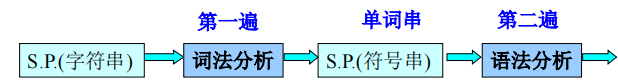
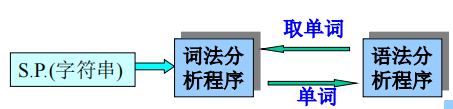

# 第三章 词法分析

[TOC]

## 3.1 词法分析程序的功能机及实现方案

- 功能

  > - 词法分析：根据词法规则识别及组合单词，进行词法检查
  > - 对数字常数完成数字字符串到数值的转换
  > - 删去空格字符和注释

- 实现方案

  1. 词法分析单独作为一遍

     

     优点：结构清晰，各遍功能单一

     缺点：效率低

  2. 词法分析程序作为单独的子程序

     

     优点：效率高

## 3.2 单词的种类及词法分析程序的输出形式

