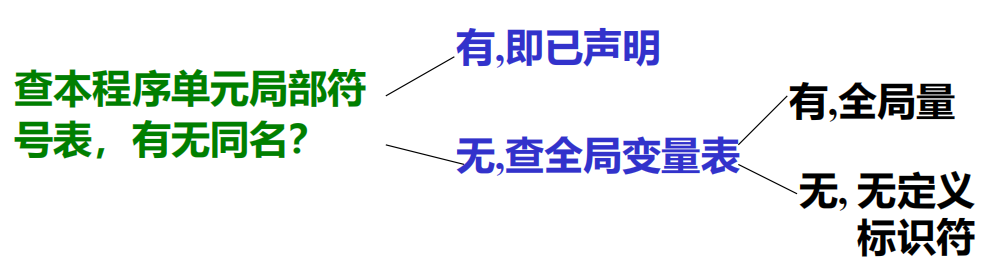
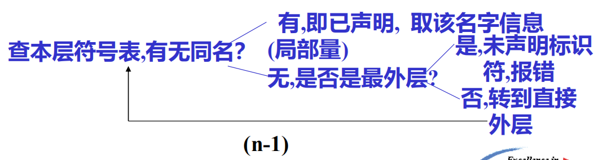

# 第五章 符号表管理技术

[TOC]

## 5.1 概述

1. 符号表

   > 编译过程中，编译程序用来记录源程序中各种名字的特征信息，也称名字特性表

   **名字**：程序名、过程名、函数名、用户定义类型名、变量名、常量名、枚举值名、标号明等。

   **特征信息**：上述名字的种类、类型、维数、参数个数、数值及目标地址（存储单元地址）等。

2. 建表和查表的必要性（符号表的作用）

   - 源程序中变量要先声明才能引用
   - 用户通过**声明语句**声明各种名字，并给出类型、维数等信息，编译程序在处理这些声明语句时应将名字及相关信息**登录**到符号表中，而存储单元地址也必须登录在符号表中。
   - 编译程序编译到引用所声明的变量时（赋值或引用其赋值），要进行语法予以正确性检查（类型是否符合要求）和生成响应的目标程序，这就需要查符号表以取得相关信息。

3. 有关符号表的操作：填报和查表

   **填表**：当分析到程序中的说明或定义语句时，应将说明或定义的名字，以及与之有关的信息填入符号表。

   **查表**：

   - 填表前查表，检查在程序的同一作用于内名字是否重复定义；

   - 检查名字的种类是否与说明一致；

   - 对于强类型语言，要检查表达式中各变量的类型是否一致；

   - 生成目标指令时，要去的所需要的地址。

     ……

## 5.2 符号表的组织与内容

### 5.2.1 符号表的结构与内容

**基本结构**

| 名字 | 特征（信息） |
| ---- | ------------ |
|      |              |

**“名字”域**：存放名字，一般为标识符的符号串，也可以为指向标示符字符串的指针。

**“特性”域**：可包括多个子域，分别表示标识符的有关信息，如：

```txt
名字（标识符）的种类：简单变量、函数、过程、数组、标号、参数等
类型：如整型、浮点型、字符型、指针等
性质：变量形参、值形参等
值：常量名所代表的数值
地址：变量所分配单元的首址或地址位移
大小：所占的字节数
作用域的嵌套层次：
```

**对于数组**：维数、上下界值、计算下标变量地址所用的信息（数组信息向量）以及元素类型等。

**对于记录（结构、联合）**：域的个数，每个域的域名、地址位移、类型等。

**对于过程或函数**：形参个数、所在层次、函数返回值类型、局部变量所占空间大小等。

**对于指针**：所指对象类型等。

### 5.2.2 符号表的组织方式

1. **统一符号表**：不困什么名字都填入统一格式的符号表中

   > 表项硬干信息量最大的名字设计，填表查表比较方便，结构简单，但浪费大量空间。

2. 对于不同来的名字分别建立各种符号表

   > 节省空间，但填表和查表不方便。

3. 折中办法：大部分共同信息组成统一格式的符号表，特殊信息领设附表，两者哟在哪个指针连接。

## 5.3 非分程序结构语言的符号表组织

> **非分程序结构语言**：每个可独立进行编译的程序单元是不包含子模块的单一模块，如FORTRAN语言。

### 5.3.1 标识符的作用于及基本处理办法

1. 作用域：

   **全局**：子程序名，函数名和公共区名。

   **局部**：程序单元中定义的变量。

2. 符号表的组织

   

3. 基本处理办法：

   1. 子程序、函数名和公共区名填入全局符号表。

   2. 在子程序（函数）声明部分读到标识符，造局部符号表。

      

   3. 在语句部分读到标识符，查表

      

4. **程序单元结束**：释放该程序单元的局部符号表。

5. **程序编译完成**：释放全部符号表。

### 5.3.2 符号表的组织方式

1. **无需符号表**：按扫描顺序建表，查表要逐项查找

   查表操作平均长度$\frac{n+1}{2}$

2. **有序符号表**：符号表按变量名进行字典排序

   线性查表：$\frac{n+1}{2}$

   折半查表：$\log n-1$

3. **散列符号表**（Hash表）：符号表地址=Hash（标识符）

   解决冲突

## 5.4 分程序结构语言的符号表组织

> **分程序结构语言**：模块内可以嵌入子模块

### 5.4.1 标识符的作用于和基本处理方法：

**作用域**：标识符局部与所定义的模块（最小模块）

1. 模块中所定义的标识符作用域是定义该标识符的子程序。
2. 过程或函数说明中定义的标识符（包括形参）其作用域为本过程体。
3. 循环语句中定义的标识符，其作用域为该循环语句。

**基本处理办法**：

建、查符号表均要遵循表束缚的作用于规定进行

- **建表**：不能重复、不能遗漏

- **查表**：按标识符作用域

**处理方法**：

1. 程序声明部分读到标识符时（**声明性**出现）建表

   

2. 在语句中读到标识符（**引用性**出现）查表

   

3. 标准标识符处理

   主要是语言定义的一些标准过程和函数的名字，是标识符的子集。如sin cos abs

   **特点**：

   - 用户不必声明，就可以全程使用
   - 设计编译程序时，标准名字及其数目已知

   **处理方法**：

   - 单独建表：使用不便，费事
   - 预先将标准名填入最外层表中

> 过程和函数体编译完成后，应将与之相应的参数名和局部变量名以及后者的特性信息从符号表中删去