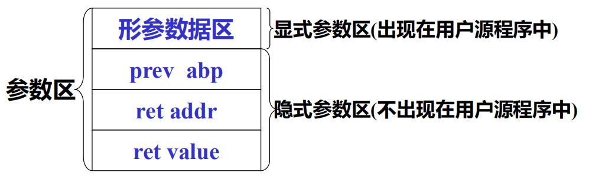
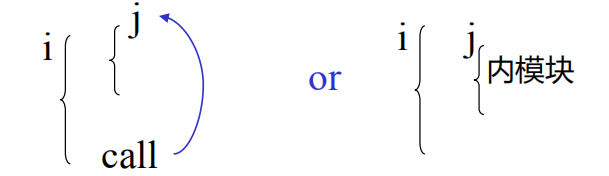
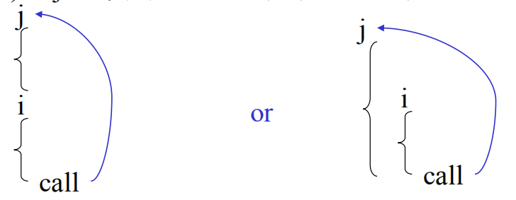

# 第六章 运行时的存储组织及管理

[TOC]

## 6.1 概述

### 6.1.1 运行时的存储组织及管理

目标奥程序运行时所需存储空间的组织与管理以及源程序中变量存储空间的分配。

### 6.1.2静态存储分配和动态存储分配

#### **静态存储分配**

- **编译阶段**由**编译程序**

​		存储空间的管理

​		为源程序中的变量分配存储空间。

- **条件**:

​		编译阶段能够确定变量在运行时的数据空间大小

​	运行时不改变。

#### **动态存储分配**

- **运行阶段**由**目标程序**

​		对存储空间的组织与管理

​		为源程序中的变量分配存储空间

- **特点**：

​		目标程序运行时进行变量的存储分配。

​		编译时要生成进行动态分配的目标指令。

## 6.2 静态存储分配

**分配策略**

> 简单的方法

- 开辟数据区（加载时确定首地址）
- 按顺序给每个模块分配空间
- 模块内部按顺序给模块的变量分配存储空间，一般使用相对地址，大小由变量类型决定
- 目标地址填入变量的符号表中

**模块（FORTRAN子程序）的完整数据区**

> - 变量
> - 返回地址
> - 形参个数
> - 临时变量


## 6.3 动态存储分配

> - 编译时不能确定所需空间
> - 编译生成有关存储分配的目标代码
> - 目标程序运行时分配空间

**分程序结构且允许递归调用的语言使用栈式动态存储分配**

**分配策略**：整个数据区作为一个栈

1. 进入过程时在栈顶围棋分配数据区
2. 退出时撤销过程数据区

### 6.3.1 活动记录


1. 局部数据区

   存放模块中定义的各个局部变量

2. 参数区

   存放隐式参数和显式参数

   

   | 区域        | 功能                                                         |
   | ----------- | ------------------------------------------------------------ |
   | `prev abp`  | 存放调用模块记录基地址，函数执行完时，释放起数据区，数据区指针指向调用前的位置 |
   | `ret addr`  | 返回地址，即调用语句的下一条执行指令地址                     |
   | `ret value` | 函数返回值（无值则空）                                       |
   | 形参数据区  | 每一形参都要分配数据空间，形参单元中存放实参值或实参地址     |

   

3. `display`区

   存放各种外层模块活动记录的基地址

   其中变量采用二元地址`（BL、ON）`

   `BL`：声明变量所在层次（并列过程具有相同层次）

   ```question
   什么是并列过程
   ```

   `ON`:相对于显示参数区的开始位置的位移

   *显然是相对地址*

### 6.3.2 建造display区的规则

从`i`层模块进入`j`层模块

1. 若$j=i+1$

   

   **复制`i`层的`display`，然后增加一个指向`i`层模块记录基地址的指针**

2. 若$j<=i$即调用外层模块或同层模块

   

   **将`i`层模块的`display`区中前面`j-1`个入口复制到第`j`层模块的`display`区**

### 6.3.3 运行时的地址计算

> 要访问的地址为`(BL, ON)`，在`LEV`层模块中引用

计算地址

```python
if BL = LEV then
	addr:=abp+(BL-1)+nip+ON
else if BL < LEV then
	addr:=display[BL]+(BL-1)+nip+ON
else
	write("地址错误，不合法的模块层次")
```

