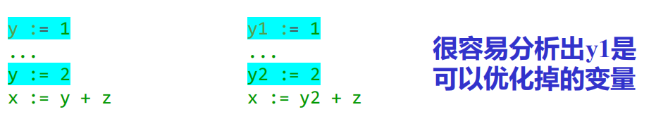
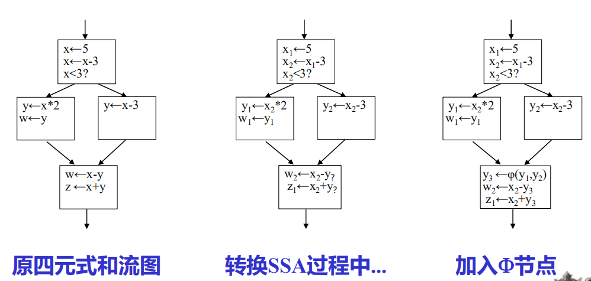

# 第七章 源程序的中间形式

[TOC]

## 7.1 波兰表示

> | 示例                  | 波兰表达式          |
> | --------------------- | ------------------- |
> | $F*3.1416*R*(H+R)$    | $F3.1416*R*HR+*$    |
> | $A:=F*3.1416*R*(H+R)$ | $AF3.1416*R*HR+*:=$ |

**算法思想**：设一操作符栈；读到操作数时立即输出，读到操作符时与栈顶操作符比较优先级，栈顶操作符高则输出该栈顶操作符。然后栈外操作符入栈

- `if`语句的波兰表示

  `if`语句：$if<expr>then<stmt_1>else<stmt_2>$

  波兰表示：

  $<expr><label_1>BZ<stmt_1><label_2>BR<stmt_2>$

  | 操作符 | 类型         | 说明                                                   |
  | ------ | ------------ | ------------------------------------------------------ |
  | `BZ`   | 二目操作符   | 若$<expr>$的计算结果为0，则产生一个到$<label_1>$的转移 |
  | `BR`   | 单目运算算符 | 产生一个到$<label_2>$的转移                            |

## 7.3 抽象机代码

> 许多pascal编译系统生成的中间代码是一种称为P-code的抽象代码，P-code的“P”即“Pseudo”

>抽象机：
>
>​		寄存器
>
>​		保存程序指令的存储器
>
>​		堆栈式数据及操作存储

| 寄存器 | 功能                                                   |
| ------ | ------------------------------------------------------ |
| `PC`   | 程序计数器                                             |
| `NP`   | New指针，指向堆顶。堆存放由New生成的动态数据。         |
| `SP`   | 运行栈指针，存放所有可按源程序的数据声明直接寻址的数据 |
| `BP`   | 基地址指针，即指向当前活动记录的其实位置指针。         |
| 其他   | 如MP-栈标志指针，EP-极限栈指针等                       |

运行P-code的凑张继没哟专门的运算器或累加器，所有的运算都在运行栈的栈顶进行。

*P-code实际上是波兰表示形式的中间代码*

**编译程序生成P-code指令程序后，我们可以用一个虚拟机来解释或者即使编译执行P=code**

**显然生成抽象机P-code的编译程序是与平台无关的**

## 7.4 N-元表示

> 在该表示中，每条指令由n个域组成，同城第一个域表示操作符，其余为操作数。

常用的n元表示有三元式和四元式

### 7.4.1 三元式

| 操作符 | 左操作数 | 右操作数 |
| ------ | -------- | -------- |

- 表达式的三元式

  $w*x+(y+z)$
  $$
  \begin{array}{l}
  (1)*,w,x\\
  (2)+,y,z\\
  (3)+,(1),(2)\\
  (3)式中(1)(2)代表两式运算结果
  \end{array}
  $$

- 条件语句的三元式

  ```python
  if x > y then
  	z:=x;
  else z:= y + 1;
  ```

  $$
  \begin{array}{l}
  (1)-,x,y\\
  (2)BMZ,(1),(5)\\
  (3):=,z,x\\
  (4)BR,\quad,(7)\\
  (5)+,y,1\\
  (6):=,z,(5)\\
  (7)...\\
  ......
  \end{array}
  $$

  其中

  | 操作符 | 类型       | 功能                                                         |
  | ------ | ---------- | ------------------------------------------------------------ |
  | `BMZ`  | 二元操作符 | 测试第二个域的值，若<=0，则按第三个域的地址转移，否则按顺序进行 |
  | `BR`   | 一元操作符 | 按第三个域的地址转移                                         |

  使用三元式不便优化，因为优化需要删除、修改三元式的位置，依赖行号的三元式必须做出相应的修改，因而使用间接三元式

  **间接三元式**：

  > 三元式的执行次序用另一张表表示

  *很朴素的想法，相当于给每个三元式额外加了一个“序号”属性（指针）*

  

### 7.4.2 四元式

| 操作符 | 操作数1 | 操作数2 | 结果 |
| ------ | ------- | ------- | ---- |

> 结果：通常是由编译引入的临时变量，可由编译程序分配一个寄存器或主存单元。

- **特殊的四元式：SSA**

  > 静态单一赋值形式的IR主要特征是==每个变量只赋值一次==。

  **优点**：

  1. 简化优化过程
  2. 获得更好的优化结果

  

  *可以由四元式转化而来，下面是流图，看看得了*

  

  *特点是针对每个值本身都是用一个新的变量，避免混淆*
