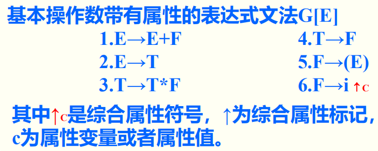
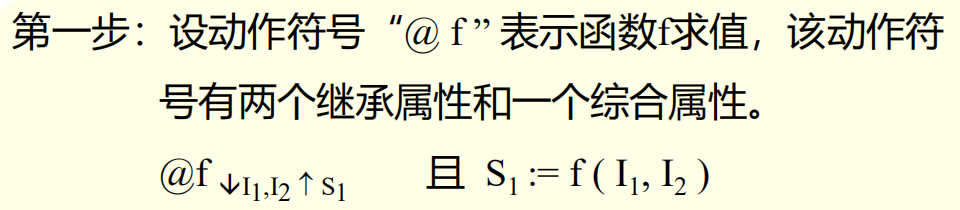

# 第九章 语法制导技术

[TOC]

## 9.0 概论

> 本章介绍语义分析和中间代码生成技术

程序语言的语义形式化描述有三种基本方法

- 操作语义
- 指称语义
- 公理语义

## 9.1 翻译文法和语法制导翻译

**输入文法**：

​	未插入动作符号时的文法

​	由**输入文法**可通过推到产生**输入序列**

**翻译文法**：

​	插入动作符号`@`的文法。

​	由**翻译文法**可以通过推导产生**活动序列**->$\begin{cases}输入序列\\动作序列\end{cases}$

**活动序列**

> $(i@i+i@i@+)*i@i@*$

*此例为生成中缀表达式的文法*,翻译任务是转为波兰后缀表示

活动序列是由翻译文法导出的符号串，由**终结符**和**动作符号**组成。

从活动序列中：

- 抽取**动作符号**，则得到**输入序列**$(i+i)*i$
- 抽去**输入序列**，则得到**动作序列**，执行动作序列，完成翻译任务$@i@i@+@i@*=>ii+i*$

### 9.1.1 翻译文法

> 翻译文法是上下文无关文法，**终结符号集**由**输入符号**和**动作符号**组成
>
> 由翻译文法所产生的终结符号串称为**活动序列**

1. **符号串翻译文法**

   插入文法中的动作符号对应的语义子程序是**输出动作符号标记@后的字符串**的文法。

2. **语法制导翻译**

   **按翻译文法进行的翻译**

   给定输入符号串，根据翻译文法获得**翻译该符号串的动作序列**，并**执行**该序列规定的动作的过程。

<b>翻译文法所定义的翻译是</b><b style="color: red">由输入序列和动作戏序列组成的对偶集</b>

## 9.2 属性翻译文法

> 翻译文法中的符号（终结符、非终结符和动作符号）均可带有属性

*能更好的描述和实现编译过程*

**分类**:

- 综合属性
- 继承属性

### 9.2.1 综合属性



- 此文法能产生以下序列：

  $ (i_{↑3}+i_{↑9})*i_{↑2}$

- 写出该输入序列的语法树：

  

- 改写语法树以表示属性求值过程

  

  其中：

  - p, q, r为变量名
  - 属性变量名局部于每个产生式，也可使用不同名
  - 求值规则 **自右向左**、**自底向上**

### 9.2.2 继承属性

> 有一产生`var`变量声明语句的文法
>
> 翻译任务为将声明的变量填入符号表
>
> 完成该工作的动作符号：`@set_table`

翻译文法
$$
\begin{array}{l}
<说明>→Type \quad id@set\_table<变量表>\\
<变量表>→, \quad id@set\_table<变量表>\\
<变量表>→ε
\end{array}
$$
设计属性
$$
\begin{array}{l}
Type_{↑t} \quad t中放类型值\\
id_{↑n} \quad n中放变量名\\
填表动作符号也可带有属性\\
@set\_table_{↓t_1,n_1} \quad ↓t_1,n_1继承前面的值\\
<变量表>_{↓t_2} \quad ↓t_2同上
\end{array}
$$
**属性翻译文法**


*我放弃了敲起来太痛苦了*

==继承属性求值：自左向右，自顶向下==

==综合属性求值：自右向左，自底向上==

*暂时不能完全理解，一会再说例子*

### TIPS 助记

> 未必准确但好记

- 综合属性用==↑==因为**自底向==上==**，有”**上传**“值的意思
- 继承属性用==↓==因为**自顶向==下==**，有”**下载**“值的意思

### 9.2.3 L-属性翻译文法

#### 9.2.3.1 L-属性翻译文法（L_ATG)

> 输入文法要求为LL(1)文法，自顶向下分析构造分析器，分析过程中进行属性求值。

**L-属性翻译文法**

*不是特别严谨，更多作为辅助而不是主力算法*

1. 终结符、非终结符以及动作符号都带有属性，且每个属性都有一个值域。

2. 非终结符及动作符号的属性可分为继承属性和综合属性

   *终结符没有继承属性，毕竟谁来继承呢？*

3. 开始符号的继承属性具有指定的初始值

4. 输入符号（终结符号）的每个综合属性具有指定的初始值

5. 属性的求值规则：*在LL(1)文法这点定义后面*

**LL(1)文法**

- 定义：

  $FOLLOW(A)=\{a|Z=>...Aa...,\quad a∈V_t\} \quad A∈V_n,Z为识别符号$

  该集合称为A的**后继符号集合**

- 定理：

  文法G是LL(1)文法的==充分必要条件==是：

  对于G的每个非终结符A的任意两条规则$A::=α|β$，下列条件成立

  1. $FIRST(α)∩FIRST(β)=∅$

     *解决回溯*

  2. $若β=^*>ε,则FIRST(α)∩FOLLOW(A)=∅$

     *判断是否要在A处终止分析，还是继续进入α*

  *看不懂没关系，后面还会讲*

**属性求值规则**：

1. **继承属性**

   1. **产生式左部**非终结符号的值取自前面产生式右部**该符号已有**的继承属性值

      *字面继承*

   2. **产生式右部**符号的值用**该产生式左部符号**的继承属性或出现在**该符号左部的符号**的属性值进行计算

      *通过前文计算*

    > 体现自顶向下，自左向右

2. **综合属性**

   1. 产生式右部废话总结符号的值取自下部产生式左部同名非终结符号的综合属性值

      *奇怪的“提取”之术*

   2. 左部非终结符的值，用该产生式左部符号的继承属性或某个右部符号的属性进行计算

   3. 动作符号的值用该符号的继承属性或某个右部符号的属性进行计算。

   > 体现自底向上，自右向左

*确实很不严谨，所以说只是辅助手段*

#### 9.2.3.2 简单形式的L-属性翻译文法（SL-ATG）

> 一般属性计算：$x:=f(y,z)$
>
> SL-ATG属性计算：$x:=某符号的属性值或常量$

- **定义**：

  一个`L-ATG`被定义为简单赋值形式的`SL-ATG`，当且仅当满足如下条件：

  - 产生式右部符号的继承属性是一个常量，等于左部符号的继承属性值或等于出现在所给符号左边符号的一个综合属性值。

  - 产生式左部非终结符号的综合属性是一个常量，他等于左部符号的继承属性值或等于右部符号的综合属性值。

  因此，一个简单形式的L-ATG除动作符号外，其余符号的属性求值规则（是个函数）的右侧（他的右值）是属性或常数

  *也就是属性求值过程时赋值不是计算*

- $L-ATG=>SL-ATG$

  

  1. 设计符号

  2. 修改产生式

     

  
  
  

```text
没太看懂
解释：这是在设计属性翻译文法，不断调整动作符号的位置从而根据求值规则让动作符号的属性得到/传递正确的值
```

## 9.3 自顶向下语法制导分析

### 9.3.1 翻译文法的自顶向下翻译

> 递归下降翻译器

*其实就挺正常的，就是你想的那些东西*

### 9.3.2 属性文法自顶向下翻译的实现

> 递归下降翻译器

**对每个非终结符都编写一个翻译子程序（过程）。根据该非终结符具有的属性数目设置相应参数**


- 过程（翻译子程序）调用语句的实参

  - （计算）继承属性（时）：（其他）继承属性值
  - （计算）综合属性（时）：（其他）属性变量名（传递至，返回时有值）

  *这里的“其他”不一定是其他符号，只要不是待计算的这一处就可以*

- 关于属性名的约定

  1. 产生式左部的同名非终结符使用相同的属性名。（递归下降分析法所必须）

     

  2. 具有向南通值的属性取相同的属性名（可删去属性求值规则）

     

  *1是必须的要求，2是简化方面的“优化”*

*例子还是看ppt去吧，挺传统的*