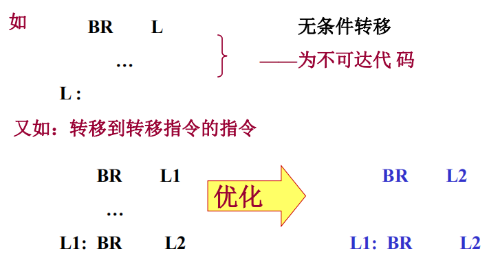
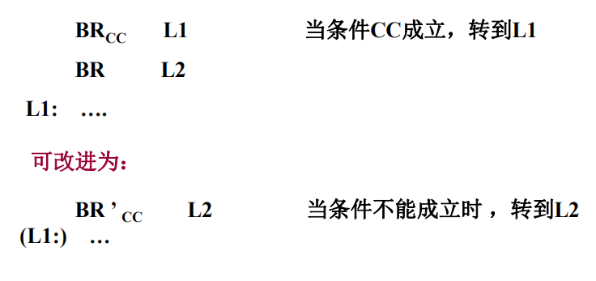
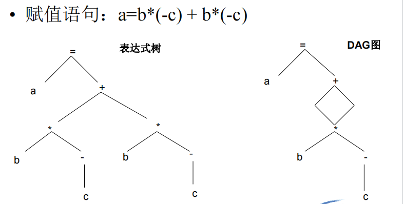

# 第十四章 代码优化

[TOC]

> 优化分类1
>
> - 与机器无关
>
>   - 数据流分析
>   - 常量传播
>   - 公共子表达式
>   - 死代码删除
>   - 循环交换
>   - 代码内联
>
> - 与机器有关
>
>   - 面向超标量超流水线架构、VLIW或者EPIC架构的指令调度方法
>   - 面向SMP架构的同步负载优化方法
>   - 面向SIMD、MIMD或SPMD架构的数据集并行优化方法
>
>   *<a style="color:Gray">（都什么玩意）</a>*

> 优化分类2
>
> - 局部优化
>
>   - 基本快内
>
>     <a style="color: Purple">局部公共子表达式删除</a>
>
> - 全局优化
>
>   - 函数/过程内
>
>   - 跨越基本块
>
>     <a style="color: Purple">全局数据流分析</a>
>
> - 跨函数优化
>
>   - 整个程序
>
>     <a style="color: Purple">跨函数别名分析，逃逸分析等</a>
>
>     *<a style="color: Gray">又看不懂咯</a>*

## 14.1 基本块和流图

### 14.1.1 基本块

1. **基本块**

   - 基本块中的代码是连续的语句序列

   - 程序的执行(控制流)只能从基本块的第一条语句进入

   - 程序的执行只能从基本块最后一条语句离开

​	<a sytle="color: RoyalBlue">该局部达到最大的连续语句序列</a>

2. **划分基本块**

   ```算法
   输入：四元式序列
   输出：基本块列表，每个四元式仅出现在一个基本块中
   ```

   $$
   \begin{array}{l}
   1. 首先确定入口语句（每个基本快第一条） \\
   	\qquad 1.1 整个语句序列的第一套语句属于入口语句 \\
   	\qquad 1.2 任何能由条件/无条件跳转语句转移到的第一条语句属于入口语句 \\
   	\qquad 1.3 紧跟在跳转语句之后的第一条语句属于入口语句 \\
   2. 每个入口语句直到下一个入口语句或程序结束，之间的所有语句都属于同一个基本块
   \end{array}
   $$

### 14.1.2 流图

1. **流图**

   - 有向图

   - 节点为基本块

   - 某个执行序列中 $B2$ 的执行紧跟在 $B1$ 之后，则从 $B1$ 到 $B2$ 有一条有向边

   - 称 $B1$ 为 $B2$ 的**前驱**，$B2$ 为 $B1$ 的**后继**

     - 从 $B1$ 的最后一条语句有条件或无条件转移到 $B2$ 的第一条语句，或

     - 按程序的执行次序， $B2$ 紧跟在 B1 之后，且 B1 没有无条件转移到其他基本快中

       ```问题
       这里没有有条件转移了？
       ```

2. **循环的查找**

   - 若从首节点出发，任何到达节点 $B$ 的路径上都要经过 $A$ ，那么 $A$ 就是 $B$ 的**<a style="color: Red">必经节点</a>**，记为 ==A dom B==
   - 若有边 $B\rightarrow A$ 且 $A\quad dom\quad B$，该边记为循环的**<a style="color: Red">回边</a>**，循环体包括能到达<a style="color: RoyalBlue">（不必从首节点开始）</a> $B$ 且不经过 $A$ 的所有节点

## 14.2 代码优化

### 14.2.0 优化的基本方法和例子

> 实际优化映在中间代码或目标代码上进行，为便于说明这里用原程序形式举例

#### 14.2.0.1 代数变换

- 编译时完成常量表达式的计算，整型与实型的转换（常量）
  $$
  \color{Purple}{
  \begin{array}{l}
  a:=5+6+x\quad \rightarrow \quad a:=11+x\\
  x为实型则x:=3+1\quad \rightarrow \quad 4.0
  \end{array}
  }
  $$

- 下标变量引用时，地址计算一部分工作可在编译时预先做好，运行时仅需计算可变部分

- **运算强度削弱**：用需要较少执行时间的运算代替另一种运算，以减少时空开销
  $$
  \color{Purple}{
  \begin{array}{l}
  x^{**}2\rightarrow x^*x\\
  3^*x\rightarrow x+x+x\\
  8^*x等换成左移运算\\
  x/2等换成右移运算\\
  x:=x+1变为INC \quad x指令\\
  x/5\rightarrow x^*0.2等
  \end{array}
  }
  $$
  利用硬件所提供的的一些功能提高代码效率

#### 14.2.0.2 复写传播

如 $x:=y$ 这样的赋值语句称为**复写语句**。由于x和y的值相同，所以当满足一定条件时，在该赋值语句下面出现的x可用y来代替。
$$
\color{Purple}{
\begin{array}{l}
x:=y; \quad \quad \quad \quad x:=y; \\
u:=2^*x; \quad \rightarrow \quad u:=2^*y; \\
v:x+1 ;\quad \quad \quad v:=y+1;
\end{array}
}
$$
复写传播也可能变成<a style="color: Red">常量传播</a>，甚至进一步引起常量计算

#### 14.2.0.3 删除冗余代码

> **冗余代码/死代码/无用代码**：没有实际意义的代码，如不必要的语句和无法到达的语句

#### 14.2.0.4 循环优化

1. 应重点优化循环体

2. 专用于循环的优化

   1. 循环不变式的代码外提

      >  **不变表达式**：不随循环控制变量改变而改变的表达式或子表达式

   2. 循环展开

      将构成循环体的代码（不包括控制部分和转移部分）重复产生多次（可在编译时确定）。是一种以空间换时间的方法。

      <a style="color: Purple">例子就是已知循环数，完全已知的循环</a>

      **条件**

      - 必须知道循环的终值，初值及步长
      - 不是所有展开都合适。<a style="color: RoyalBlue">展开实质上主要省略判断、跳转和更新判断相关变量的过程若循环内不能省略的语句较多则会导致展开命令过多却只省略了少量命令</a>

      **判断准则**：

      - 主存资源丰富且处理机时间宝贵
      - 循环体语句少

   3. 其他方法

      - 多层嵌套循环->单层循环
      - n个相同形式的循环->一个循环

#### 14.2.0.5 in_line展开

把过程/函数调用改为in_line展开可节省许多处理过程/函数调用花费的开销
$$
\color{Purple}{
\begin{array}{l}
procedure\quad m(i,j:integer;max:integer); \\
\qquad begin \\
\qquad \qquad if\quad i>j\quad then\\
\qquad\qquad \qquad max:=i\\
\qquad\qquad  else\\
\qquad\qquad \qquad max:=j\\
\qquad end;\\
若有过程调用m(k,0,max); \\
则内置展开后\\
\qquad if\quad k>0 \quad then \\
\qquad \qquad max:=k\\
\qquad else\\
\qquad \qquad max:=0\\
\end{array}
}
$$
<a style="color: RoyalBlue">省去哈数调用时的参数压栈，保存返回地址等指令
显然仅限于较简单函数</a>

#### 14.2.0.6 其他，如控制流方法



### 14.2.1 基本块的DAG图表示

> DAG图
>
> - 图的**叶节点**由**变量名或常量**标记。对于基本块内先引用再赋值的变量，可采用==变量名加下标0==的方式命名起初值
> - 图的**中间节点**由中间代码的**操作符**标记，代表基本块中一条或多条中间代码
> - 基本块中变量的最终计算结果都对应图中一节点；具有初值的变量，其初值和最终值可以对应不同的节点

> 

*<a style="color: Gray">如何构建DAG见下</a>*

### 14.2.2 消除局部公共子表达式

```算法
通过构建DAG消除局部公共子表达式
输入：基本块内的中间代码序列
输出：完成局部公共子表达式删除后的DAG
方法：
1. 建立节点表，记录变量名和常量值，以及当前所对应的DAG图中的节点序号

2. 从第一条中间代码开始，按以下规则建立DAG

3. 对形如z = x op y，其中z为记录结果的变量名，x为左操作数，y为右操作数，op为操作符。

先在节点表中寻找x

	若找到，记录x当前所对应的节点号为i；
	
    否则在DAG中新建一个叶节点，假设其节点号仍为i标记为x（若x为变量名则标记为x0）；在节点表中增加一项(x, i)表明对应关系，y同理，假设其对应节点号为j
    
4. 在DAG中寻找中间节点，满足：标记为op，且其左右操作数节点号分别是i,j

	若找到，记录其节点号为k
	
	否则在DAG中新建一个中间节点，假设其节点号仍为k，将ij分别连至左右子节点
	
5.在节点表中寻找z

	若找到，将z所对应的节点编号更改为k
	
	若未找到，在节点表中新建(z, k)表明二者关系
	
6. 对输入的中间代码序列依次重复(3)~(5)

```

**说明**：

1. 上述中间代码形式 `z = x op y` 中， `x` 或 `y` 均可为空
2. 如 `z = x` 形式，只需得到节点 `i` 再建立 `z` 和 `i` 的关系即可

### 14.2.3 数组、指针及函数调用

中间代码序列出现数组成员、指针或函数调用时，**上述算法需要调整**

$$
\color{Purple}{
\begin{array}{l}
x=a[i]\\
a[j]=y\\
z=a[i]\\
如果算法不改变，会将x和z划归到同一节点\\
即认为x和z相等，\\
而事实上，该算法无法考虑到ij相等时x与z未必相等的情况
\end{array}
}
$$
<a style="color:RoyalBlue">其本质是数组、指针、函数存在“调用”机制：即用变量调用变量，静态分析时无法确定被调用者是谁</a>

**解决方法**：

- 数组：

  - 将**取值**和**赋值**使用两个不同的操作符，==将数组看做一个整体==，一旦被赋值则认为”数组变量“已被改变

- 指针

  - 一旦出现对指针的解引用赋值后，放弃后面所有指针赋值（即都认为是不同的）

- 函数

  - 函数调用后认为所有可能被该函数改变的变量都被改变
  - 或读到函数调用时将现有的DAG写会中间代码，从函数调用后再开始DAG

  *$\color{Gray}{保守的思路，宁可错杀一千绝不放过一个}$*

### 14.2.4 从DAG重新导出中间代码

当多个局部变量共享同一个节点时，需要生成显示的赋值语句为所有变量赋值。

若无法判断某变量在函数出口是否活跃，一般按活跃处理。

同一个DAG可以写为不同的中间代码，为了提高性能，给出如下算法：

```算法
/* 
* 从DAG导出中间代码的启发式算法
* 输入：DAG图
* 输出：中间代码序列
*/
1. 初始化一个防止DAG中间节点的队列
2. 如果DAG中还有中间节点未进入队列，则执行步骤3，否则执行步骤5
3. 选取一个尚未进入队列，但其所有父节点均已进入队列的中间节点n，将其加入队列；或选取没有父节点的中间节点，将其加入队列。
4. 如果n的最左子节点符合步骤3的条件，将其加入队列；并沿着当前节点的最左边，循环访问其最左子节点，将
```


### 14.2.5 窥孔优化

> 关注目标指令一个较短的序列