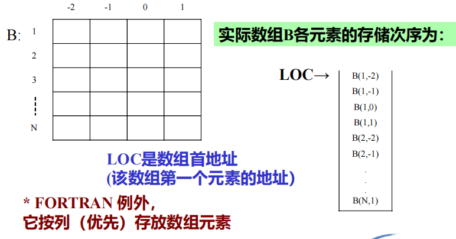
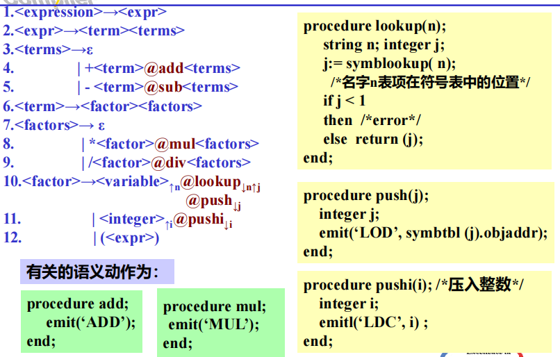
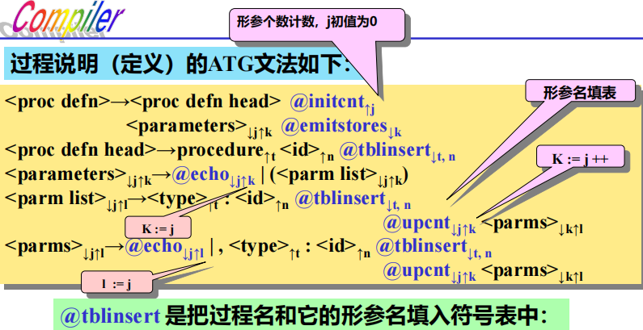

# 第十章 语义分析和代码生成

[TOC]

> **源语言**：通用的过程语言
>
> **生成代码**：栈式抽象机的（伪）汇编程序
>
> **翻译方法**：自顶向下属性翻译
>
> **语法成分翻译子程序参数设置**：
>
> - 继承属性为值形参
> - 综合属性为变量形参
>
> **语法成分翻译动作子程序参数设置**：
>
> - 继承属性为值形参
> - 综合属性不设形参，而作为动作子程序的返回值

## 10.1 语义分析

> 1. 上下文有关的分析 *标识符作用域等*
>
> 2. 类型一致性检查
>
> 3. 语义处理
>
>    ​	声明语句
>
>    执行语句

## 10.2 栈式抽象机及其汇编指令

**栈式抽象机**：三个存储器、一个指令寄存器、多个地址寄存器

存储器：

​	数据存储器 存放AR**运行栈**

​	操作存储器 **操作数栈**

​	指令存储器


## 10.3 声明的处理

> 处理圣铭渔具主要需要完成填表动作

声明有两种方式，多种类型

*$\color{Gray}{看看吧万一选择题要考呢}$*

- 方式

  1. 类型说明符在变量前，如C语言。**特点**是填表前已知类型和名字，可直接填入符号表

  2. 类型说明符在变量后，如PL/I

     $\color{Purple}{例 DECLARE(X) FLOAT}$。

     **特点**是需要反填(应该是预读后返回来填表)

- 类型

  1. 常量
  2. 变量
     - 简单变量
     - 数组变量
     - 记录变量 *$\color{Gray}{这是什么}$*
  3. 过程（函数）

### 使用属性翻译文法（以反填为例

$\color{RoyalBlue}{通过在文法中插入动作程序实现阅读文法的同时完成符号表，可能是想要并入语法分析在“一遍”内完成编译任务}$
$$
\color{Purple}{
\begin{array}{l}
<declaration>->DECLARE'('<entity\quad list>')'<type>\\
<entity\quad list>-><entity\quad name>|<entity\quad name>,<entity\quad list>\\
<typr>->FIXED|FLOAT|CHAR
\end{array}
}
$$
**扩充为属性翻译文法**
$$
\color{Purple}
\begin{array}{l}
<declaration>->DECLARE\color{Red}{@dec\_on_{↑x}}\color{Purple}'('<entity\quad list>')'<type>_{↑t}\color{Red}{@fix\_up_{↓x,t}}\color{Purple}\\
<entity\quad list>-><entity\quad name>_{↑n}\color{Red}{@name\_defn_{↓n}}\color{Purple}|<entity\quad name>_{↑n},\color{Red}{@name\_defn_{↓n}}\color{Purple}<entity\quad list>\\
<typr>_{↑t}->FIXED_{↑t}|FLOAT_{↑t}|CHAR_{↑t}
\end{array}
$$
**其中的动作程序**

- $@dec\_on_{↑x}$

  把符号表当前可用表项入口地址赋值给属性变量x$\color{RoyalBlue}{寻址}$

- $@name\_defn_{↓n}$

  将由各**实体名**所得的n继承属性值，依次**填入**(从x开始的)符号表中

- $@fix\_up_{↓x,t}$

  将**类型信息**t和对应的**数据存储区分配地址填入**x开始的符号表中（反填）

### 10.3.1常量类型声明处理

**常量标识符常被看作全局名**

*$\color{Gray}{翻译过程没什么特别的，就是在def的读入全部信息后加了个@insert继承全部属性+执行填表动作}$*

@insert的功能

- 有初值时检查初值类型与声明类型是否匹配
- 填表

### 10.3.2 简单变量声明处理

相比常量，type多了所需空间大小这一综合属性

另外动作符号变为两个*$\color{Gray}（当然也可以合并）$*，一个分管**填表**，一个分管**分配地址指针**

变长字符串可以通过存放首指针来引用该实体

*==题外话但因为没有存放长度所以容易越界访问还不好查==*

### 10.3.3 数组变量声明的处理

- **静态数组**可以建立**数组模板**（**数组信息向量**），后续引用时可以按模板信息计算元素（下标变量）的存储地址**$\color{Red}因为编译时已知数组大小$**
- **动态数组**编译时仅为模板分配一个空间，模板本身内容在运行时填入**$\color{Red}因为运行时才能知道数组大小$**

#### 10.3.3.1 数组元素存储

具体的，对于**行优先存放**的数组（多数语言都是如此）：

**元素存储次序**：


*$\color{Gray}看到例外了吧我就不多说了$*

**地址计算**


$$
\color{RoyalBlue}{
\begin{array}{l}
n是维度数
V(i)为调用元素第i维下标\\
L(i)为第i维下标下界\\
U(i)则是上界\\
E是元素大小（字节数）\\
解释P(i)/为什么要乘P(i)\\
\quad P(i)是确定了前i维下标后剩余的元素数量\\
\quad 计算ADR时，对每一个维度\\
\quad \quad 首先计算在要读取的的元素前，该维度还有几组(V(i)-L(i))\\
\quad \quad 每组都要占据改组下全部元素的空间，因此要乘P(i)\\
\end{array}
}
$$

$$
\color{Purple}{
\begin{array}{l}
说点人话，对于三维数组a[4,4,4],现在访问a[1,1,1]\\
显然该数组可以看做四个二维数组[4,4]，二维数组又可以看做4个一维数组，总的来说就是长4高4厚4\\
对于第一维度，P(1)=4*4,代表确定第一维后就确定了一个长4高4的薄片\\
那么显然V(1)-L(1)=1说明a[1,1,1]距离LOC隔着一个完整的薄片，需要加上这个薄片占据的空间\\
P(1)正是薄片中元素的数量\\
对于第二维V(2)-L(2)=1说明a[1,1,1]距离第一维确定的薄片首地址还有1个完整的层\\
P(2)正是一层中元素的数量\\
对于第三维V(3)-L(3)=1说明a[1,1,1]距离第二维确定的层的首地址还有1个完整的小块（到这里已经是元素了）\\
P(3)=1正表明一块（一个元素）中元素的数量（显然是1吧）
\end{array}
}
$$


#### 10.3.3.2 数组信息向量模板

> 功能
>
> - 计算地址
> - 检查越界


大小：3n+2

**注意**：

1. 数组模板所需空间大小取决于数组的维度，因为只要确定维度就能在编译时确定所需空间大小
2. 常界数组编译时就可造信息向量表，而变界数组因ULRC什么的都不知道因此要在运行时确定上下界后才可造表。此时需要编译程序**生成相应的指令**。

*$\color{Gray}{属性翻译文法倒也没什么可说的该干什么干什么}$*

## 10.4 表达式的处理

> 主要是为了生成中间代码
>
> 通常吧表达式中的操作数装载(LOD)到**操作数栈**（）或运行栈栈顶单元的某个寄存器中，然后执行表达式指定的操作，而结果仍保留在栈顶或寄存器中

==本章中所指的**操作数栈**（即操作栈）实际应与**动态运行（存储分配）栈**分开==

**ATG文法：**


$$
\color{RoyalBlue}{
\begin{array}{l}
省流：\\
匹配操作数1\quad 压栈\quad \\
匹配操作符\quad 留着\quad \\
匹配操作数2\quad 压栈\quad \\
压栈操作符\\
变量则查表压符号表地址，“立即数”则直接压栈
\end{array}
}
$$
增加操作数类型就增加读入和查表查类型和访问值（注意越界）呗

## 10.5 赋值语句的处理

控制“左值”属性并检查类型是否匹配（不匹配则生成类型转换代码）


## 10.6 控制语句的处理

### 10.6.1 if语句


```问题
第二行的brf如何确定JMF指令的操作数，即这个位置应该还不能确定THEN后结尾的位置
```

### 10.6.2 for循环语句

```问题
我不想努力了谁给我讲讲
```

## 10.7 过程调用和返回

### 10.7.1 参数传递的基本形式

| 传参方式   | 实现                                                         | 过程体对形参的处理                                           | 特点                                         |
| ---------- | ------------------------------------------------------------ | ------------------------------------------------------------ | -------------------------------------------- |
| **传值**   | **调用段**（过程语句的目标程序段）：计算实参==值===>操作数栈栈顶<br />**被调用段**（过程说明的目标程序段）：从栈顶取得==值===>形参单元 | 对形参的访问等于相应实参的访问                               | 单向数据传递                                 |
| **传地址** | **调用段**：计算实参==地址===>操作数栈栈顶<br />**被调用段**：从栈顶取得==地址===>形参单元 | 通过对形参的<a style="color:red">间接访问</a>来访问相应的形参 | 结果送回调用段                               |
| **传名**   | 较复杂，效率低，少用                                         | <a style="color:red">每次调用形参都</a><a style="color:RoyalBlue">直接使用名字查表，查到当前使用该名字的变量</a> | 运行效率低<br />形参可能会因为名字改变而变化 |

*$\color{Gray}太神奇了看看例子$*


#### 10.7.2 过程调用处理

调用动作

- 检查过程名是否定义，检查实参形参是否匹配
- 加载实参
- 加载返回地址
- 转入过程体（入口地址）



### 10.7.3 返回语句和过程体结束的处理

语义动作：

1. 若为函数过程，应将操作数栈（或运行栈）顶的函数结果值送入函数结果值单元

2. 生成无条件转移返回地址的指令

3. 产生删除运行栈中被调用过程活动记录的指令

   ```问题
   什么叫“只要根据DL—活动链把abp退回去即可”
   ```

## 附录 MIPS调用规范

- **调用函数** 关于参数传递

  - 使用MIPS仿真器$\color{Red}{$a0—$a3}$，从左向右依次传递==前4个参数==
  - 参数超过4个时，从左到右依次压在==运行栈(活动记录)==上
  - <a style="color: red">返回地址</a>call指令自动保存在连接寄存器==$ra==中

  $$
  \color{Purple}{
  \begin{array}{l}
  \pmb{foo(arg1,arg2,arg3,arg4,arg5,arg6);}\\
  $a0=arg1,$a1=arg2,$a2=arg3,$a3=arg4\\
  push\quad arg5\\
  push\quad arg6\\
  call foo
  \end{array}
  }
  $$

- **进入函数**

  - 编译器决定是否将$\color{Red}{$a0—$a3}$传入的参数保存在==运行栈==，还是传递给==全局寄存器==

  - **除了**叶子函数(即不会调用任何其它函数的函数)*$\color{Gray}{大意就是call graph中的“叶子节点”}$*保存返回值地址的连接寄存器$\color{Red}{$ra}$值需要编译器生成代码保存在运行栈上

    <a style="color: RoyalBlue">只要内部调用其它函数，现在的$ra就会被冲掉，从而失去返回地址</a>

  - 返回值保存在==$v0—\$v1==*$\color{Gray}{还能有两个返回值？}$*

- **临时寄存器**

  - 原则上**生存范围不超过基本块**，**不跨函数调用**
  - ==\$t0—$t7==,==\$t8—$t9==
  - 保证上下文正确性的前提下也可以用==\$a0—$a3==,==\$v0—$v1==,==$ra==

- **全局寄存器**

  - **跨越基本块，跨函数调用**
  - 函数使用的全局寄存器要==在入口悉数保存==，==返回前悉数恢复==
  - ==\$s0—$s7==

  *$\color{Gray}{封装的还挺好方便看代码好文明}$*

- **寻址及堆栈寄存器**

  - 全局指针寄存器==$gp==
  - 栈指针寄存器==$sp==
  - Frame指针寄存器==$fp==（活动记录基地址）

  <a style="color: RoyalBlue">这些是指令内部会完成的操作，所以前面说不能自己动</a>
