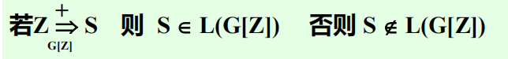
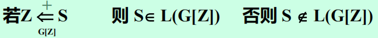

# 第四章 语法分析

[TOC]

## 4.1 概述

> **功能：**根据文法规则，从源程序**单词符号串**中识别出语法法成分，并进行语法检查。

> **基本任务：**识别符号串$S$是否为某语法成分。

> **两大分析方法：**自顶向下分析、自底向上分析

- 自顶向下

  - 基本思想

    

  - 主要问题

    - 左递归问题
    - 回溯问题

  - 主要方法

    - 递归子程序法
    - LL分析法

- 自底向上

  - 基本思想

    

  - 主要问题
    - 句柄识别

  - 主要方法
    - 算符优先分析法
    - LR分析法

## 4.2 自顶向下分析

### 4.2.1 一般过程

> 为待分析符号串$S$构造语法树

**特点：**

1. 带预测
1. 带回溯
1. 效率低

### 4.2.2 问题及解决办法

1. 不能具有**左递归文法**

   > 

   - 消除直接左递归

     1. 使用扩充BNF表示法改写文法

        > 
   	
   	   - 规则一 提因子
   	
   	     
   	
   	     **特点**：消除直接左递归、压缩文法长度
   	
   	   - 规则二
   	
   	     
   	
   	1. 将左递归规则改为右递归规则
   	
   	   - 规则三
   	
   	     
   	
   - 消除一般左递归

     1. 整理非终结符

        

     2. 

        ```
        For i:=1 to n do
        	begin
        		for j:=1 to i-1 do
        			把每个形如Ai::=Ajr的规则替换成
        			Ai::=(δ1|δ2|...|δk)r
        			其中Aj::=δ1|δ2|...|δk是当前全部Aj的规则;
        		消除Ai中的直接左递归
        	end
        ```

     3. 化简2得到的文法

2. 回溯问题

   > 文法中对于某个非终结符的规则，其右部有多个选择，并根据所面临的输入符号不能准确地确定所要的选择时，可能出现回溯。

   - **定义 $FIRST(α_i)=\{a|α_i=^*>a...,a∈V_t\}$**
   
   - 为**避免回溯**，对文法的要求是：
   
     ==$FIRST(α_i)∩FIRST(α_j)=φ (i≠j)$==
   
   - **消除回溯**
   
     1. 改写文法
   
        对有多个右部的规则反复提取左因子（直到|左右的两个符号的$FIRST$集合不相交）
   
     2. 超前扫描
   
        简单粗暴的方法，事实上对实现很不友好
   
        > 本质上也是一种“回溯”，但是不做语义处理
   
     3. 为了在**不使用超前扫描**的前提下实现**不带回溯的自顶向下分析**，对文法要求如下：
   
        1. 非左递归
   
           > 显而易见的要求
   
        2. 对文法的任一非终结符，其规则右部有多个选择时，各$FIRST$集合两两不相交
   
           > 即上文所说$FIRST(α_i)∩FIRST(α_j)=φ (i≠j)$
   
        *可以看出，当遇到难以解决的问题时，一般会直接对文法提出要求，事实上这是因为文法是被设计出来的，在设计阶段提要求可以充分发挥设计阶段的“主观能动性”*

### 4.2.3 递归子程序法（递归下降分析法）

> 对语法的每一个非终结符都编一个分析程序，当根据文法和当时的输入符号预测到要用某个非终结符去匹配输入串时，就调用该非终结符的分析程序。

*事实上就是很朴素的分析方法，所谓递归下降一来是分析遇到非终结符时直接调用该非终结符的分析程序，二来是可能存在如$Z->(U) U->(Z)$，这的确是可以接受的，其实个人认为这没什么可大惊小怪的*

**非终结符的分析子程序事实上就是用规则的右部符号串去匹配输入串**

递归子程序法对应的是**最左推导**过程

**注意**：实现时注意子程序之间的接口，进入某个非终结符的分析程序时其所要分析的语法成分的第一个符号已读入sym中

### 4.2.4 例子*（写什么例子*

### 4.2.5 LL分析法*（12章涉及但我想现在学*

> LL：自左向右扫描、自左向右地分析和匹配输入串。分析过程表现为最左推导的性质。
>
> 与递归下降分析法的区别在于这种分析不需要递归，使用不允许递归语言编写编译器时只能使用此法。

#### 1 LL分析程序构造及分析过程

由三部分组成

- 分析表
- 执行程序（总控程序）
- 符栈（分析栈）

> 实际语言中每一种语法成分都有确定的左右界符，为了研究问题方便，统一以'#'表示

1. **分析表**

   > 二维矩阵

   $$
   M[A,a]=
   \begin{cases}
   A::=α_i \quad α_i∈V^*，A∈V_n，a∈V_t \quad or \quad \# \\
   error \quad
   \end{cases}
   （不是填充规则）
   $$

   - $M[A,a]=A::=α_i$

     表示当要用A去匹配输入串时，且当前输入符号为a是，可用A的第i个选择去匹配。即

     当$α_i≠ε$时，有$α_i=^*>a...$;

     当$α_i=ε$时，则a为A的后继符号。

   - $M[A,a]=error$

     表示当用A去匹配输入串时，若当前输入符号为a，则不能匹配，表示无$α_i=^*>a...$或a不为A的后继符号。

     *即不能用A去匹配输入符号*

   **构造分析表**
   $$
   \begin{array}{l}
   有文法G[Z]：\\
   \textcolor{red}{定义：}FIRST(α)=\{a|α=^*>a...,a∈V_t\}\quadα∈V^*\\
   \qquad若α=^*>ε,则ε∈FRST(α)\\
   \qquad该集合称为α的头符号集合\\
   \textcolor{red}{定义：}FOLLOW(A)=\{a|Z=^*>...Aa...,a∈V_t\}\quad A∈V_n,Z为识别符号\\
   \qquad 该集合称为A的后继符号集合。\\
   \qquad 特殊的：若Z=^*>...A\quad则\#∈FOLLOW(A)
   \end{array}
   $$
   - 构造FIRST集的算法

     $α=X_1X_2...X_n,X_i∈V，求FIRST(α)$

     > 显然求出每个$FIRST(X_i)$再取并集即可

     1. $若X_i∈V_t，则FIRST(X_i)={X_i}$

     2. $若X_i∈V_n且X_i::=a...|ε,a∈V_t,则FIRST(X_i)={a,ε}$

     3. $若X_i∈V_n且X_i::=y_1y_2..y_k$，则按如下规则计算
        $$
        \begin{array}{l}
        FIRST(X_i)<=FIRST(y_1)-\{ε\};\\
        若ε∈FIRST(y_1),则将FIRST(y_2)-\{ε\}加入FIRST(X_i);\\
        若\begin{cases}
        ε∈FIRST(y_1)\\
        ε∈FIRST(y_2)\\
        \end{cases},则将FIRST(y_3)-\{ε\}加入FIRST(X_i);\\若\begin{cases}
        ε∈FIRST(y_1)\\
        ε∈FIRST(y_2)\\
        ε∈FIRST(y_3)\\
        \end{cases},则将FIRST(y_4)-\{ε\}加入FIRST(X_i);\\
        ......\\
        \begin{cases}
        ε∈FIRST(y_1)\\
        ......\\
        ε∈FIRST(y_{k-1})\\
        \end{cases},则将FIRST(y_k)-\{ε\}加入FIRST(X_i);\\
        若ε∈FIRST(y_1)~FIRST(y_k),则将ε加入FIRST(X_i);
        \end{array}
        $$
        **注意**：顺序执行，一旦不满足条件就终止算法

   - 构造FOLLOW集的算法

     $设S,A,B∈V_n$

     连续使用以下规则，直至FOLLOW集合不再扩大
     $$
     \begin{array}{l}
     (1)若S为识别符号，则把'\#'加入FOLLOW(S)中\\
     (2)若A::=αBβ(β≠ε)，则把FIRST(β)-{ε}加入FOLLOW(B)\\
     (3)若A::=αB或A::=αBβ,且β=^*>ε,\\
     则把FOLLOW(A)加入FOLLOW(B)中\\
     \textcolor{red}{注意：FOLLOW集中不能有ε}
     \end{array}
     $$
     *三条规则分别对应平凡情况、”后面还有“和”后面没了“，巧妙调用别家FIRST和FOLLOW集合递推求解，最后迭代完善解。*

#    I AM HERE NOW AT PPT P66

2. **符号栈**（有4种情况）

   - 开始状态

     

   - 工作状态

     

   - 出错状态

     

   - 结束状态

     

3. 执行程序

   主要实现以下操作

   1. 把#和文法识别符号E推进栈，读入下一个符号，重复下述过程直到正常结束或出错

   2. 测定栈顶符号X和当前输入符号a，执行下列动作
      $$
      \begin{array}{l}
      1.若X=a=\#，分析成功，停止。E匹配输入串成功。\\
      2.若X=a≠\#，把X推出栈，再读入下一个符号。（X匹配成功\\
      3.若X∈V_n,查分析表M\\
      	\qquad a)M[X,a]=X::UVW\\
      	\qquad 则将X弹出栈，将UVW压入栈，\textcolor{red}{注意U在栈顶（最左推导）}\\
      	\qquad b)M[X,a]=error \quad 转错误处理\\
      	\qquad c)M[x,a]=ε\\
      	\qquad a为X的后继符号，将X弹出栈\textcolor{red}{（不读下一符号）}继续分析
      \end{array}
      $$
